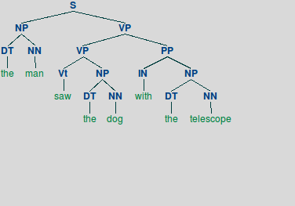
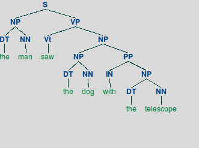

# PLN: Procesamiento de lenguaje natural 2017
---------------------------------------------
## Práctico 2
--------------------------------------------
#### Ejercicio 1

En este ejercicio se implemento eval.py. Allí teniamos que calcular las mediciones precision, recall y F1 (tanto para labeled e unlabeled). Además teníamos que limitar el número de oraciones (n) y el largo de las oraciones (m). Luego entrenamos y evaluamos los modelos “baseline” para todas las oraciones de largo menor o igual a 20.

Antes de mostrar resultados explicaremos sobre unlabeled e labeled. Además es imporante entender para que sirven las metricas precision, recall y F1.

Los parseos unlabeled son aquellos que no nos interesan los *tags*. En cambio los parseos labeled, no sólo interesa como esta parseado el árbol si no los tags de cada hoja.

*Precision* es la fracción de instancias recuperadas que son relevantes; *Recall* es la fracción de instancias relevantes que han sido recuperadas. Suponemos un programa donde identifica fotos de perros. Si tenemos 12 fotos donde 8 son de perros y el resto gatos, en el cual nuestro programa logra identificar sólo 5 fotos de perros, entonces *precision* sería 5/8 mientras que *recall* sería 5/12. *F1* combina *precision* y *recall*.

__Labeled__

|     \     |  Flat  | Rbranch | Lbranch |
|:---------:|:------:|:-------:|:-------:|
| Precision | 99.33% |  8.81%  |  8.81%  |
| Recall    | 14.58% | 14.58%  | 14.58%  |
|    F1     | 25.44% | 10.98%  | 10.98%  |

__Unlabeled__

|     \     |  Flat  | Rbranch | Lbranch |
|:---------:|:------:|:-------:|:-------:|
| Precision | 100%   |  8.88%  | 14.71%  |
| Recall    | 14.59% | 14.69%  | 24.35%  |
|    F1     | 25.46% | 11.07%  | 18.34%  |

__Tiempos__

|   \    | Tiempo(seg) |
|:------:|:-----------:|
|  Flat  |     6.85    |
|Rbranch |     7.35    |
|Lbranch |     7.59    |

Aquí podemos ver que los parseos son bastantes malos. Flat tiene un 100% de precision en unlabeled, pero gracias a la metrica F1 podemos ver que sigue siendo muy mala. Este 100% se debe a que el árbol se parsea (start_symbol, oración).

--------------------------------------------
#### Ejercicio 2

En este ejercicio se implemento CKY con backpointers (guardando el árbol).

Además se agrego a los test una gramática y una oración tal que la oración tenga más de un análisis posible (sintácticamente ambigua). Lo agregue en test_cky_parser.py

Oración: "the man saw the dog with telescope"

Es decir es ambiguo debido a que puede tener dos significados:

1. El hombre esta mirando al perro con un telescopio. Donde el árbol será el siguiente:

2. El hombre esta mirando al perro, pero quien tiene el telescopio es el perro. El árbol será:

